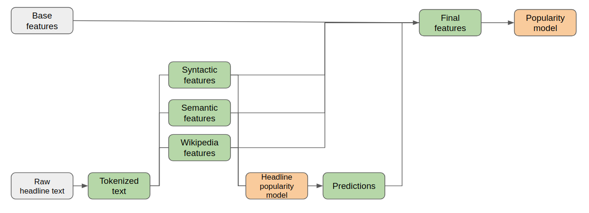

# News article popularity prediction
Predict news article popularity based on text content of the headline and the content.

Following pipeline was designed to combine information from both the headline and the content.

# Notebook description

`Notebooks/headline.ipynb` develops the headline model and adds the output as a feature to the dataset.

`Notebooks/demo.ipynb` combines the headline model output and constructs a new popularity classifier.
